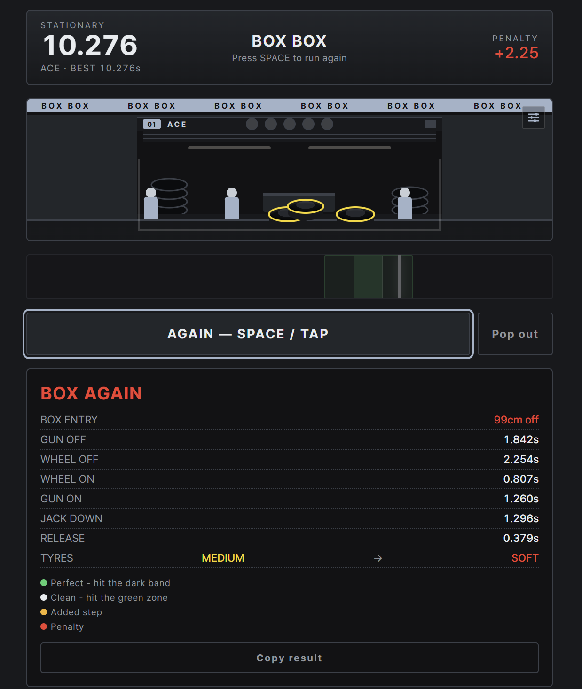

# BOX BOX

A one-key F1 pit stop game. Bring the car into the box, swap four tyres, and release it —
timed to the thousandth of a second against a real sub-2-second benchmark.

[](https://418teapot-sh.github.io/boxbox/)


[](LICENSE)




## 🏁 How to play

Everything is one key: **SPACE** (or tap).

| | |
|---|---|
| **Box entry** | The car drives in from the right. Stop it on the mark — the front jack lifts wherever you stop it. |
| **The stop** | Hit SPACE while the needle is inside the green zone. The dark band in the middle is a perfect hit. |
| **Release** | Wait for the green light, then go. |

### ⏱ What it costs you

| | |
|---|---|
| `+0.45s` | Needle outside the green zone |
| `+10.00s` | Released before the green light — an unsafe release |
| `RE-GUN` | Nuts under-torqued on GUN ON. The further your final hit lands from the middle, the likelier. A perfect hit never triggers it. |
| `DNF` | The car drove past the box without stopping |

Three difficulties — **ROOKIE / PRO / ACE** — change the needle speed, the green zone width,
the entry speed and the re-gun risk together. Best times are tracked separately per difficulty.

## 💾 Run it locally

No build, no server, no dependencies. Download `index.html` and open it in a browser.

```bash
git clone https://github.com/418teapot-sh/boxbox.git
cd boxbox
open index.html      # Windows: start index.html
```

The font is embedded in the file, so it works offline and on `file://`.

## 🔧 Tuning

Difficulty numbers live in one array near the top of the script:

```js
var DIFFS=[
  {id:'rookie',n:'ROOKIE',sweep:780,zone:0.30,entry:1450,risk:0.18},
  {id:'pro',   n:'PRO',   sweep:620,zone:0.24,entry:1150,risk:0.35},
  {id:'ace',   n:'ACE',   sweep:470,zone:0.17,entry:880, risk:0.55}
];
```

| | |
|---|---|
| `sweep` | ms for the needle to cross the meter once |
| `zone` | green zone width, as a fraction of the meter |
| `entry` | ms for the car to cross the pit lane |
| `risk` | re-gun chance at the very edge of the green zone |

`sweep × zone` is the window you actually get. PRO is 149ms; ACE is 80ms.

## 📝 Notes

Single HTML file, no dependencies, no network calls. The typeface is
[Pretendard](https://github.com/orioncactus/pretendard) (SIL OFL 1.1), subset to Latin
and embedded as a data URI.

Teams, colours and liveries are invented. No real Formula 1 team, driver or sponsor is used.

## ⚖️ License

MIT — see [LICENSE](LICENSE).
